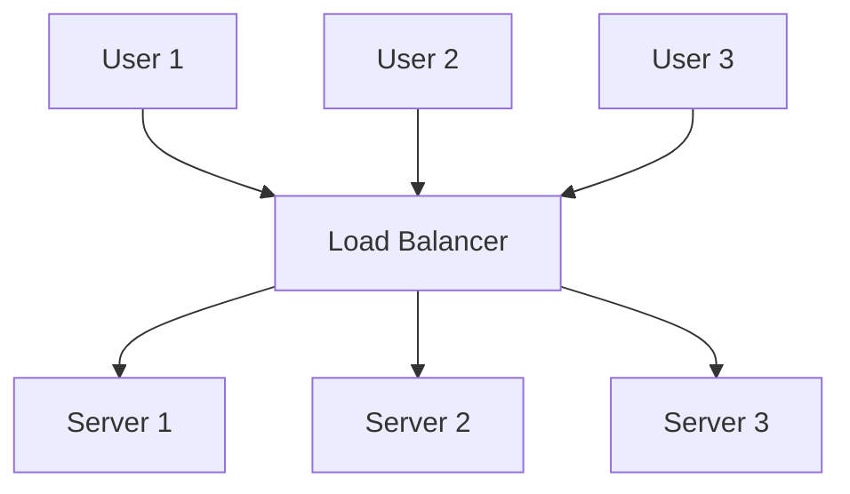
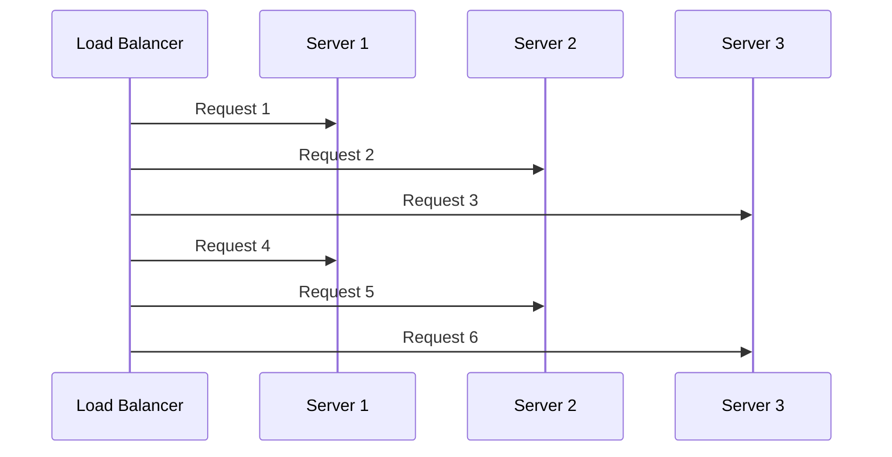
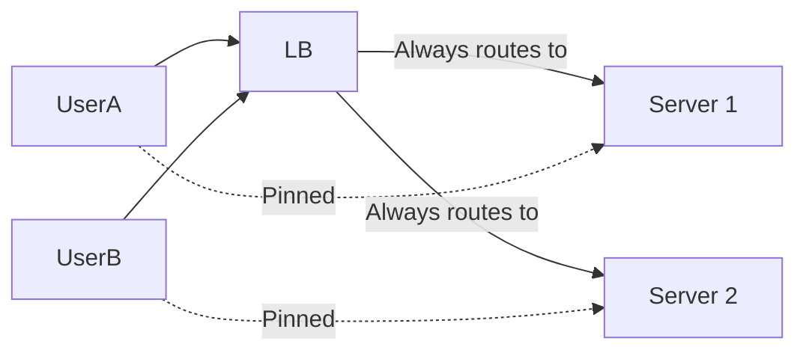

# Load Balancer Diagrams

---

## 1. Basic Load Balancer Architecture

---

## 2. Round Robin Load Balancing

Requests cycle through servers in order.

---

## 3. Sticky Session (Session Affinity)

Each user is always routed to the same server.

