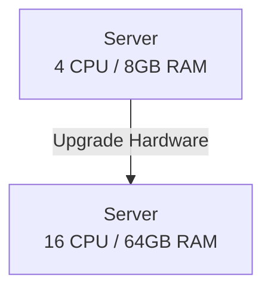
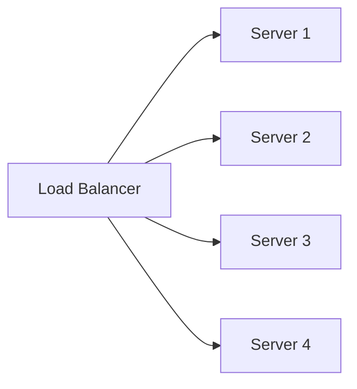

# Scaling Diagrams

---

## 1. Vertical Scaling (Scale Up)

Upgrade the existing server with more CPU and RAM.

---

## 2. Horizontal Scaling (Scale Out)

Add more servers behind a load balancer.

---

## Key Difference

| | Vertical | Horizontal |
|---|---|---|
| Method | Bigger server | More servers |
| Limit | Hardware ceiling | Almost unlimited |
| Fault Tolerance | Low | High |
