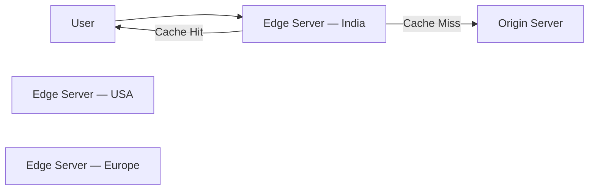
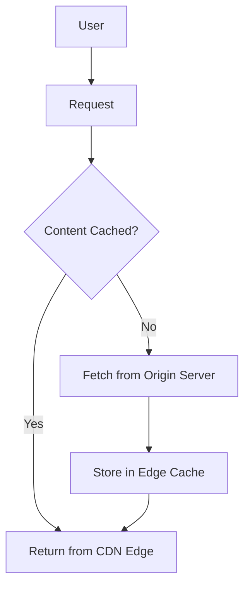
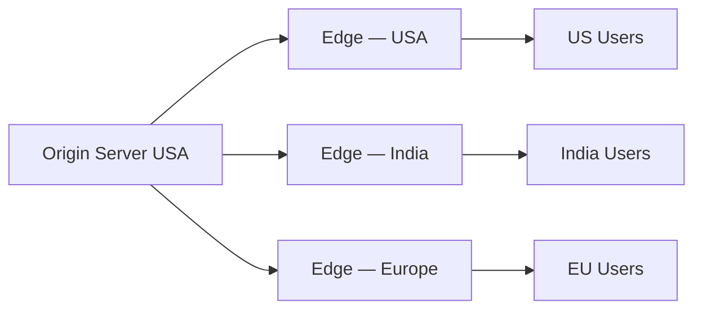

# CDN Diagrams

---

## 1. CDN Architecture

Content is served from the edge server closest to the user.

---

## 2. CDN Cache Flow

How a request moves through a CDN.

---

## 3. Global CDN Distribution

