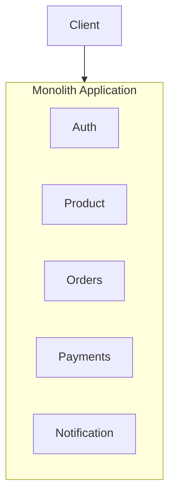
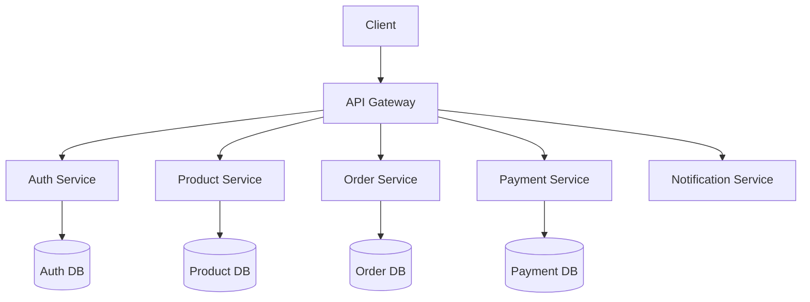

# Monolith vs Microservices Diagrams

---

## 1. Monolithic Architecture

All modules live inside one deployable unit.

**Characteristics:**
- Simple to develop initially
- Single deployment unit
- Harder to scale individual parts
- One failure can affect everything

---

## 2. Microservices Architecture

Each service is independent, owns its own database, and communicates via API.

**Characteristics:**
- Each service deploys independently
- Scale only what needs scaling
- More operational complexity
- Fault isolation per service
