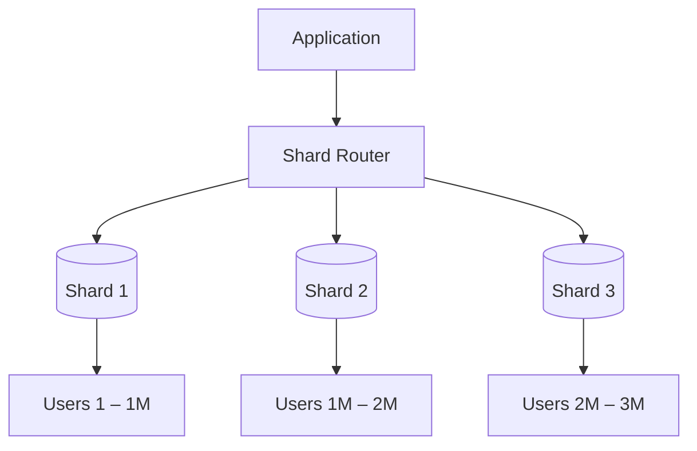
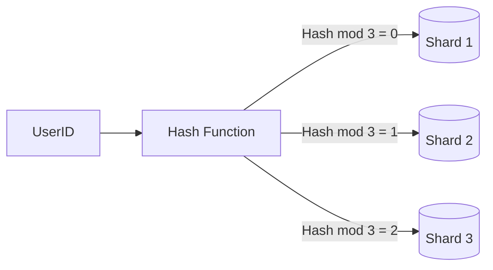
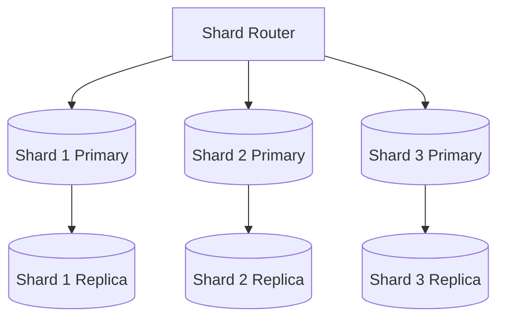

# Data Sharding Diagrams

---

## 1. Basic Sharding Architecture

A shard router distributes data across multiple database shards.

---

## 2. Hash-Based Sharding

The hash function determines which shard stores a given record.

---

## 3. Sharding + Replication (Production Pattern)

Each shard has its own replicas for read scalability and fault tolerance.

