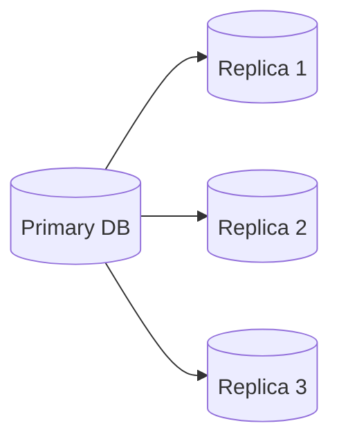
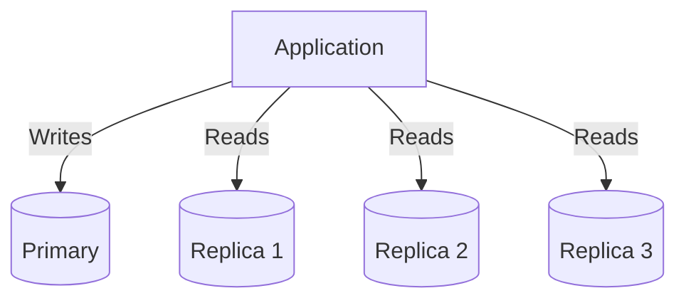
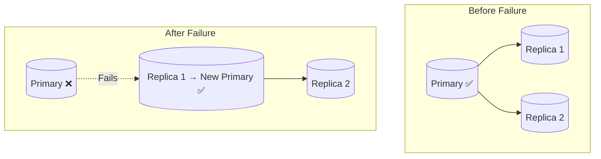
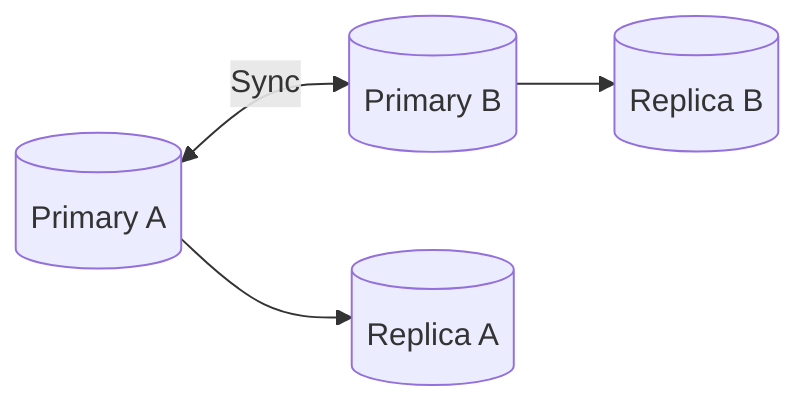

# Data Replication Diagrams

---

## 1. Primary-Replica Replication

Primary handles writes; replicas serve reads.

---

## 2. Read Replica Architecture

Application routes writes to primary and reads to replicas.

---

## 3. Failover

When primary fails, a replica is promoted automatically.

---

## 4. Multi-Leader Replication

Both nodes accept writes and sync with each other.

