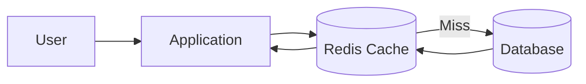
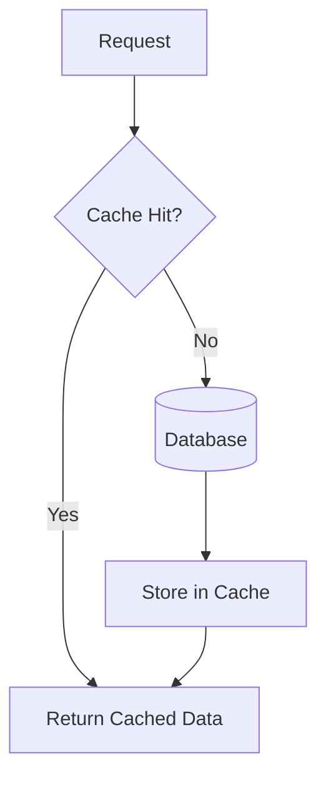
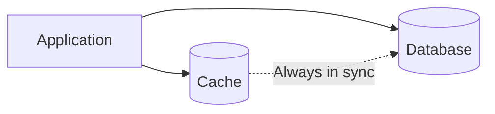
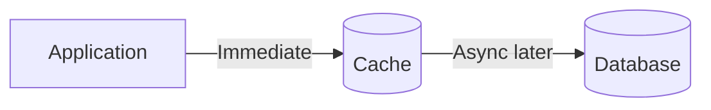
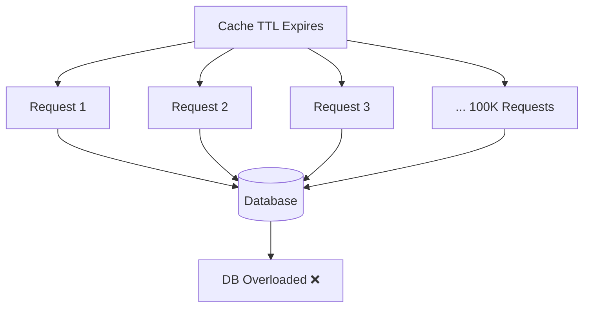
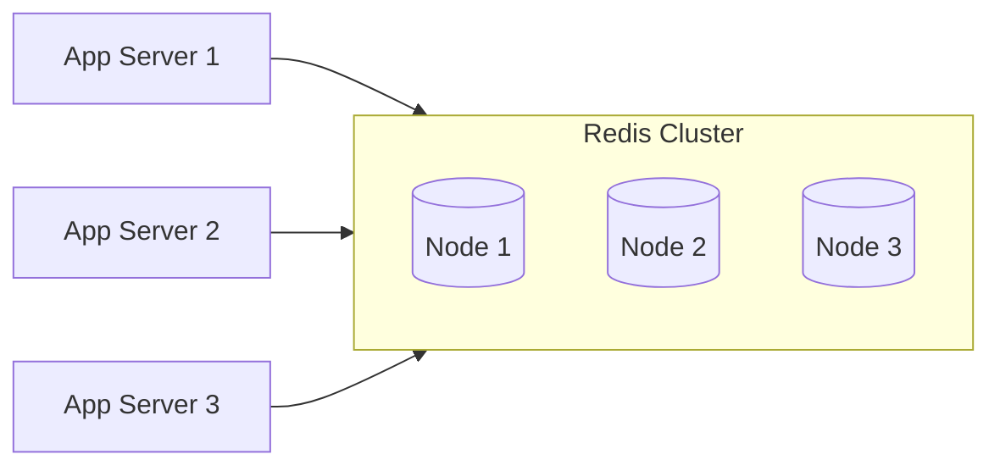

# Caching Diagrams

---

## 1. Basic Cache Architecture

---

## 2. Cache Aside Pattern (Lazy Loading)

Application checks cache first; fetches from DB only on a miss.

---

## 3. Write Through Pattern

Every write goes to cache and database simultaneously.

---

## 4. Write Back Pattern

Write to cache first; database updated asynchronously.

---

## 5. Cache Stampede Problem

Many users miss at the same time and overwhelm the DB.

---

## 6. Distributed Cache Cluster

Cache partitioned across multiple nodes.

