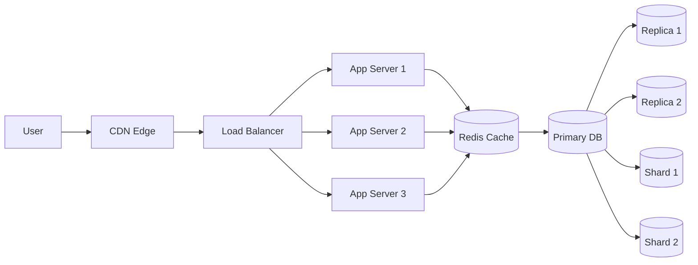
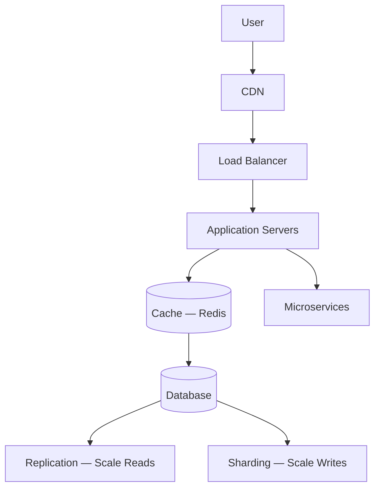
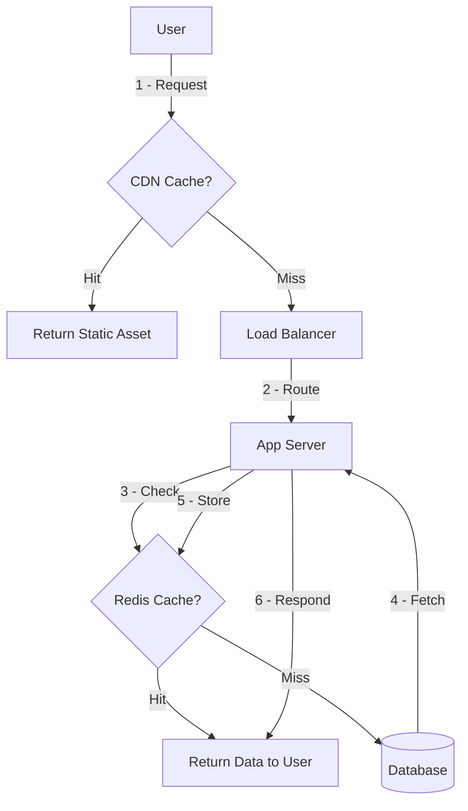
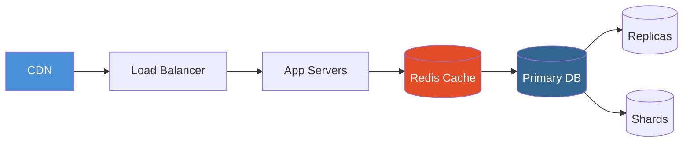

# Complete System Design Diagrams

---

## 1. High-Level System Design

Full production architecture combining all layers.

---

## 2. System Design Interview Revision

Key components and how they connect.

---

## 3. Complete Request Flow

What happens when a user makes a request end to end.

---

## 4. Internet-Scale Formula (Visual)

