# System Design Diagrams

## 1. Load Balancer Architecture

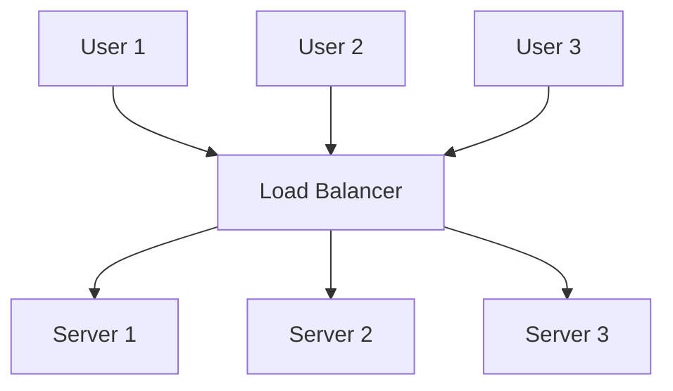

---

# 2. Round Robin Load Balancing

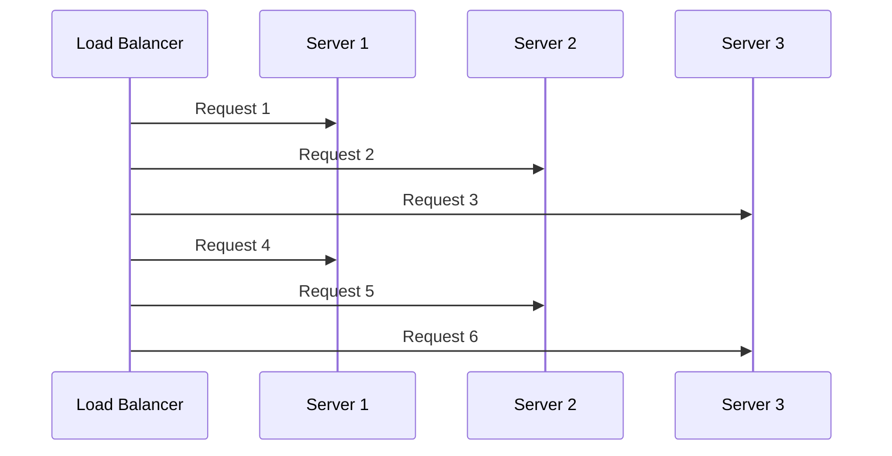

---

# 3. Sticky Session Load Balancing

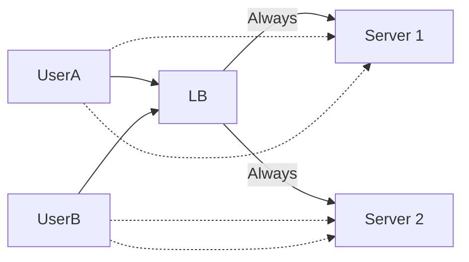

---

# 4. Vertical Scaling

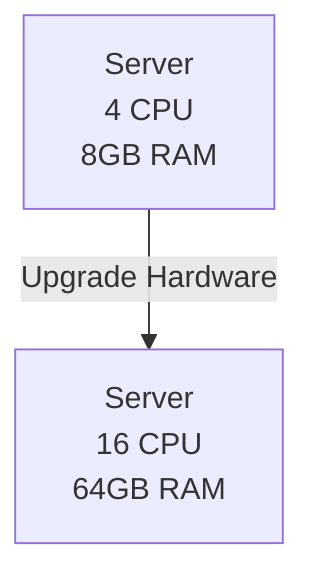

---

# 5. Horizontal Scaling

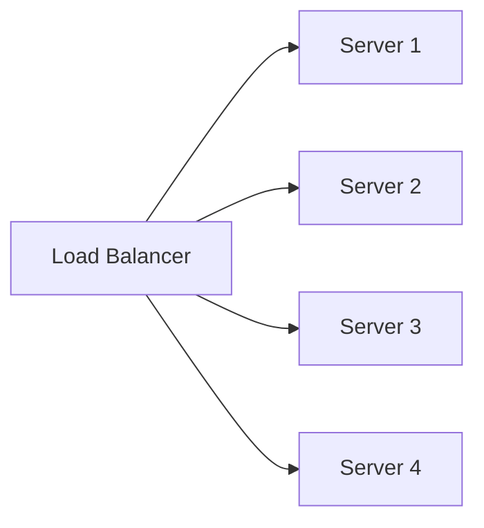

---

# 6. CDN Architecture

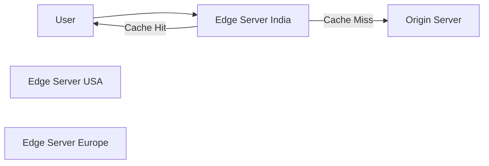

---

# 7. CDN Cache Flow

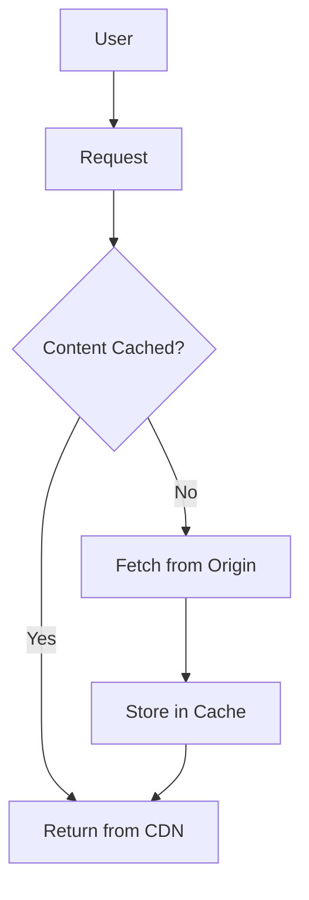

---

# 8. Monolithic Architecture

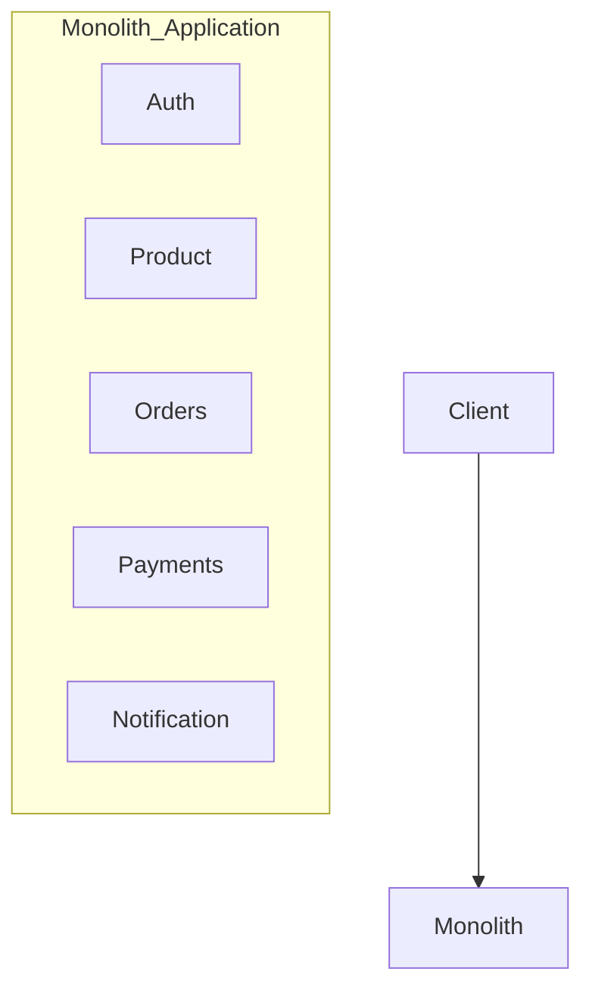

---

# 9. Microservices Architecture

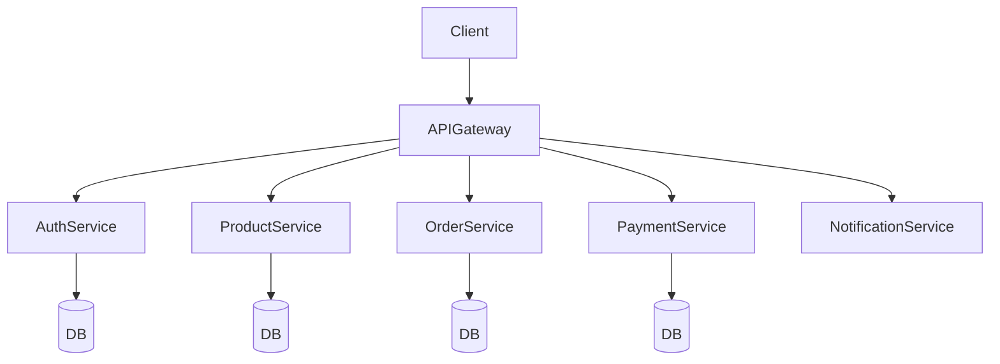

---

# 10. Data Sharding

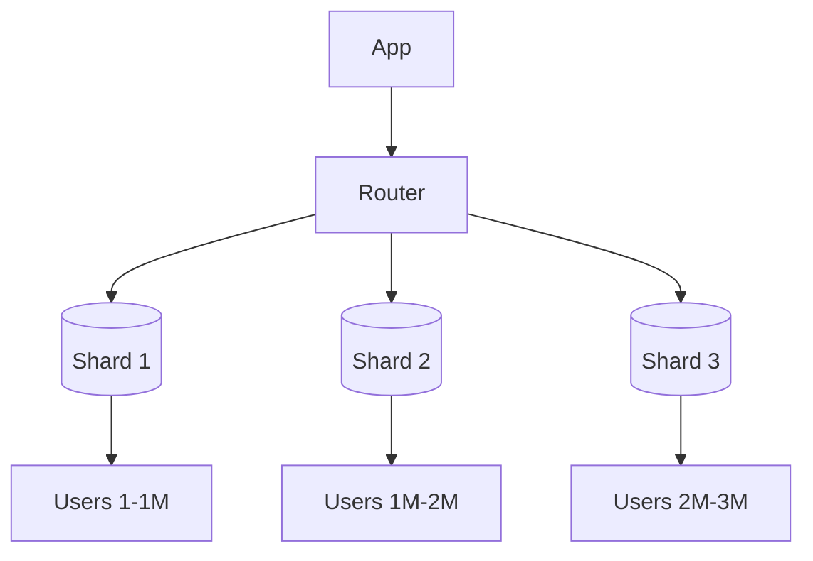

---

# 11. Hash-Based Sharding

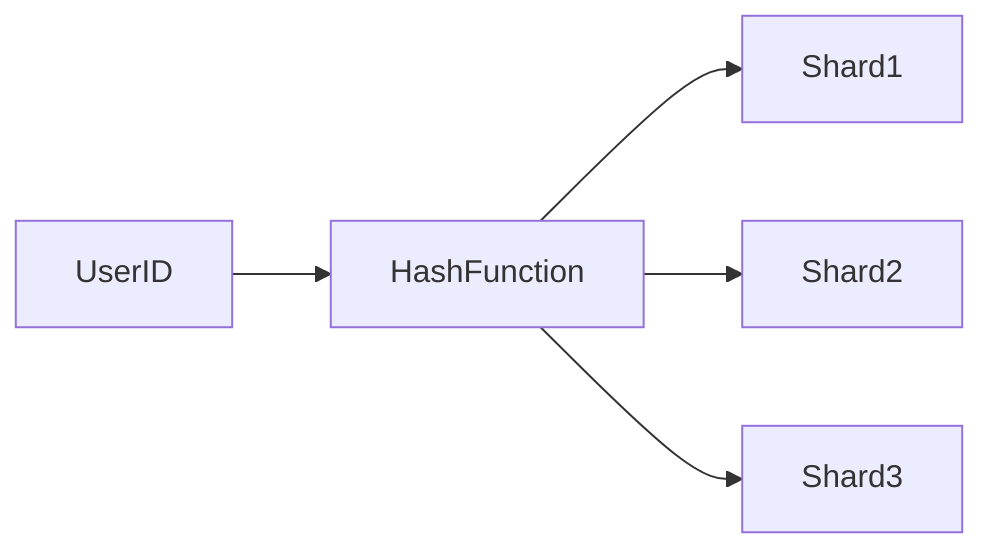

---

# 12. Data Replication

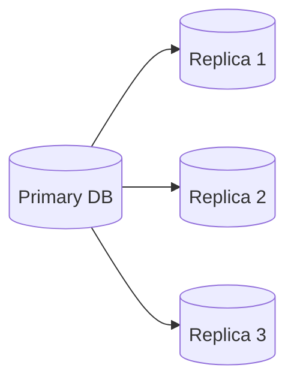

---

# 13. Read Replica Architecture

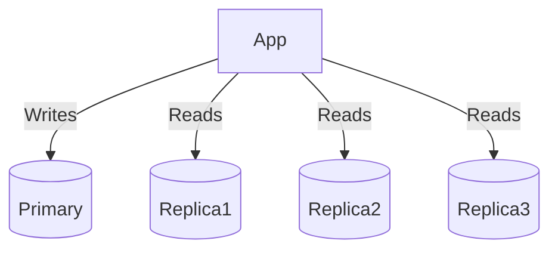

---

# 14. Cache Architecture

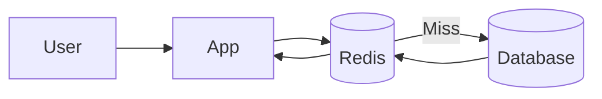

---

# 15. Cache Aside Pattern

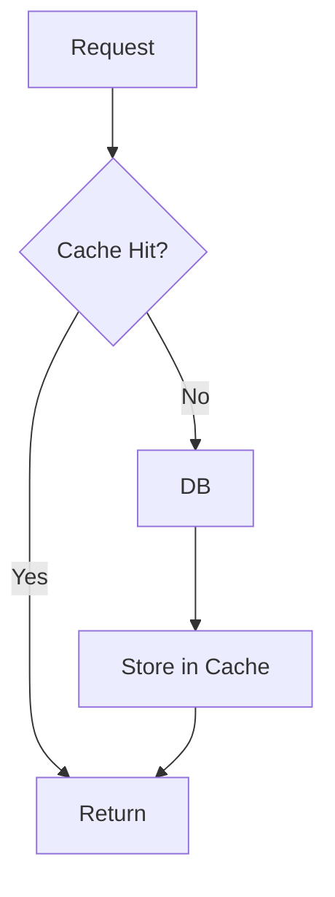

---

# 16. Complete High-Level System Design

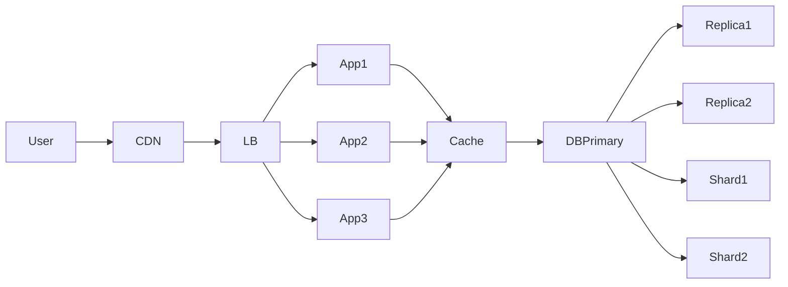

---

# 17. System Design Interview Revision Diagram

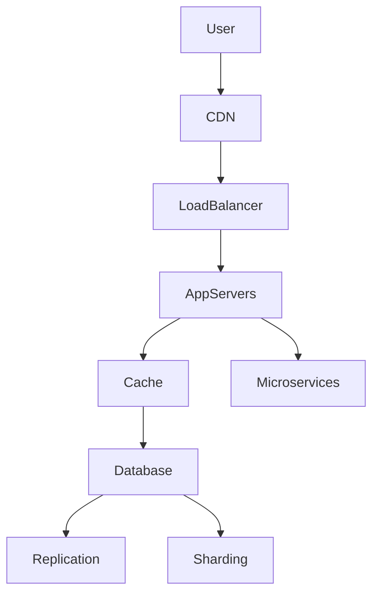

---

# Recommended Notes Repository Structure

