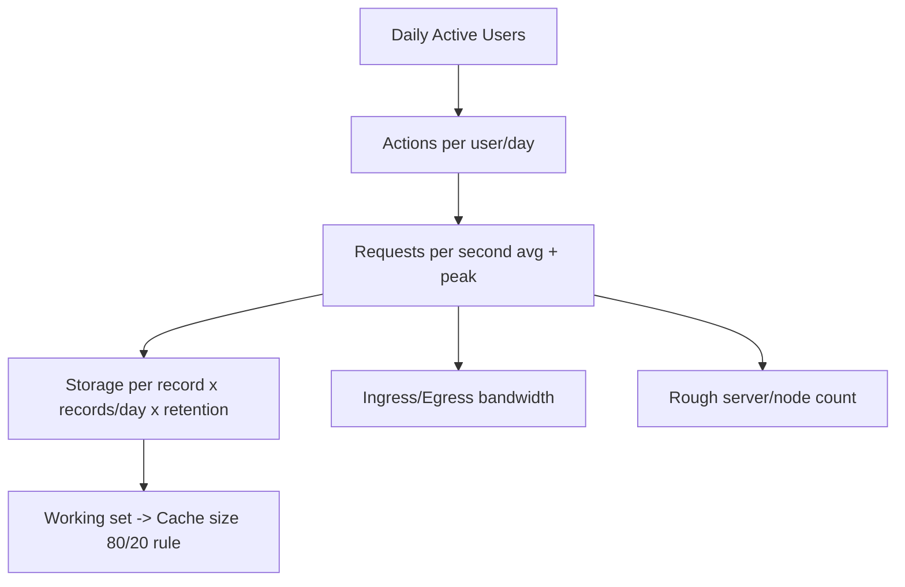
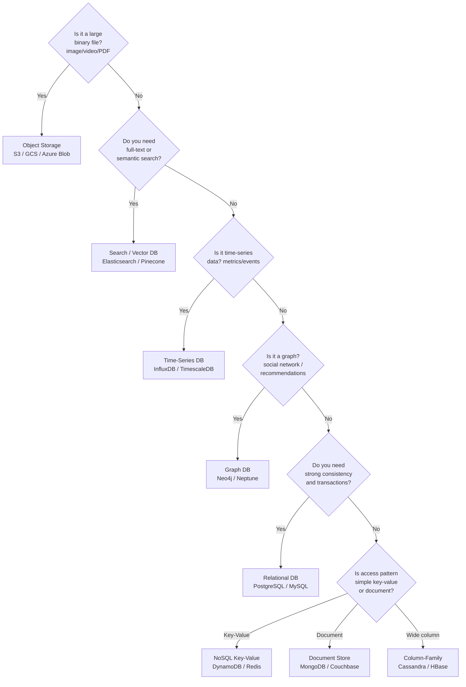
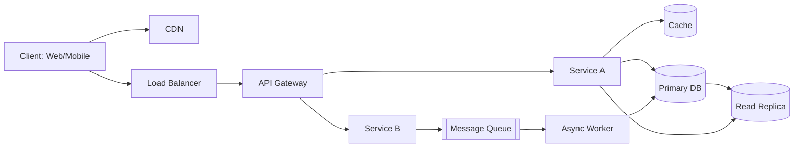
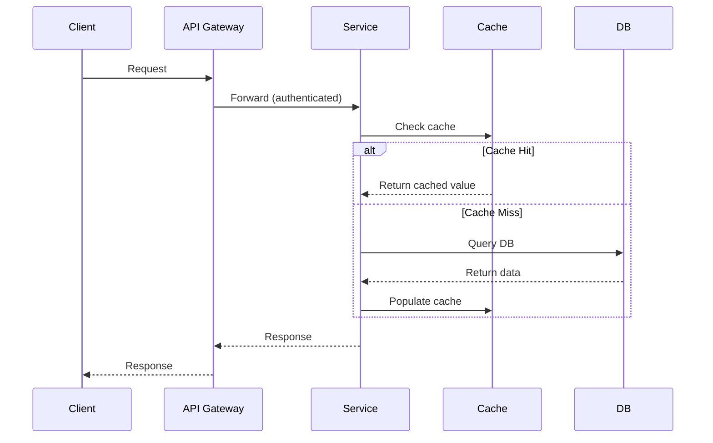
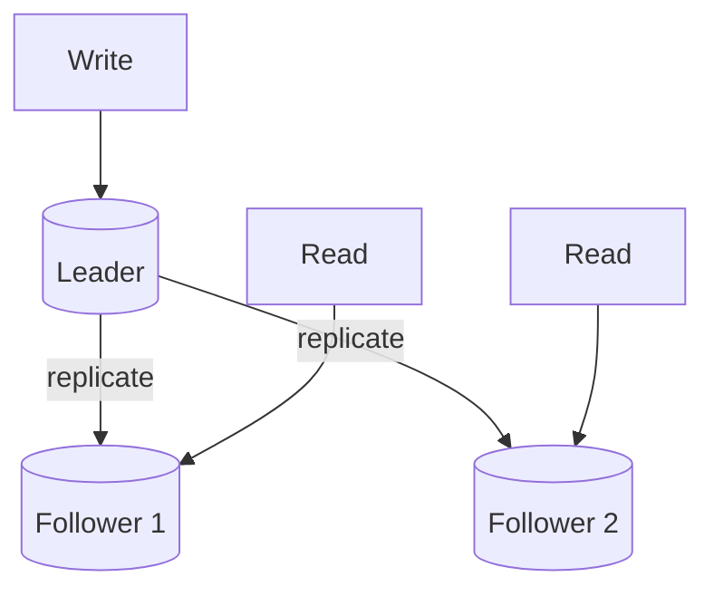
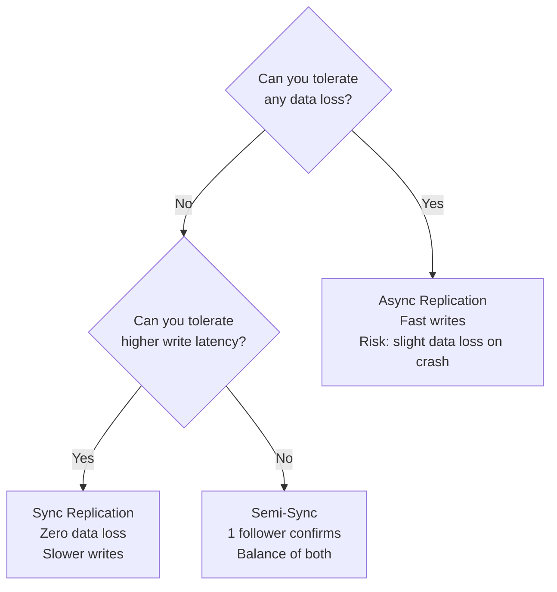
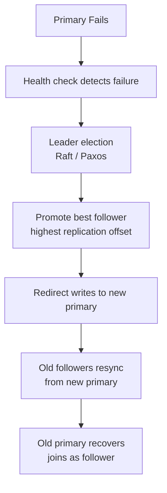
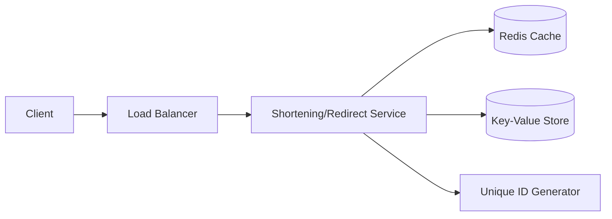
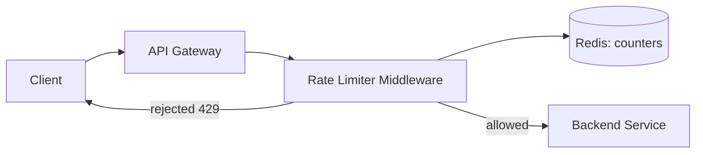
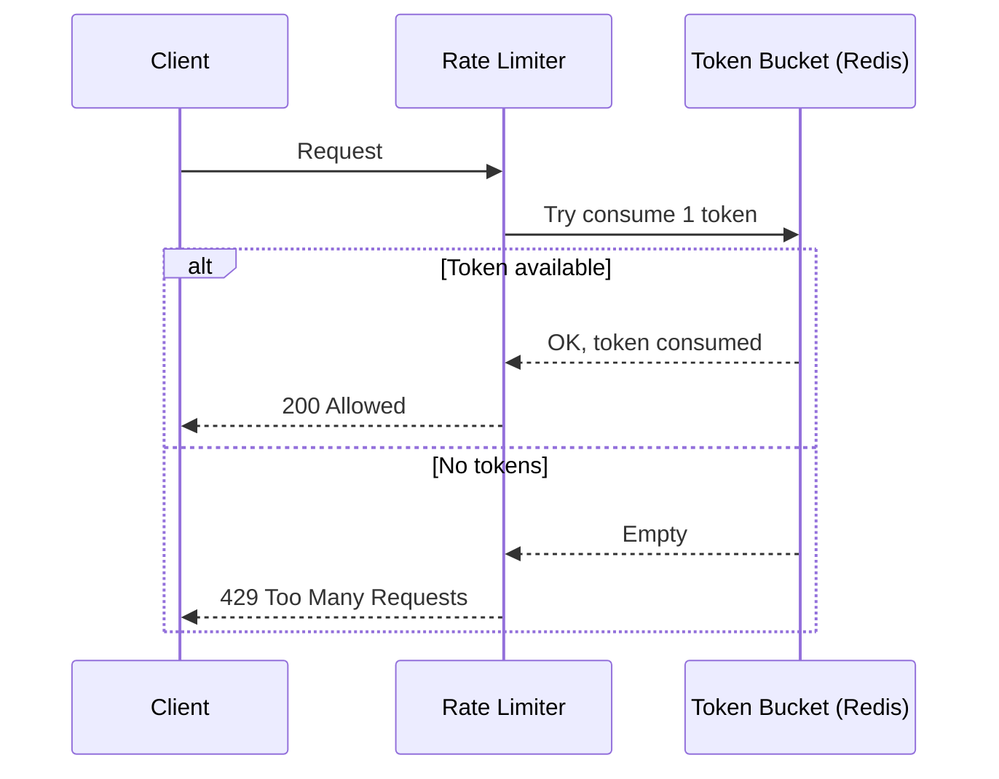

# The System Design Framework: A Blueprint You Can Apply to *Anything*

If you've ever sat in a system design interview — or tried to architect a real product at work — you know the scary part isn't the technology. It's the blank page. "Design a URL shortener." "Design Twitter." "Design a rate limiter." Where do you even *start*?

Here's the good news: you don't need a different mental model for every system. You need **one repeatable pipeline** that you run every single time, and the specifics just fill themselves in based on what you're building.

This post lays out that pipeline end-to-end, then applies it twice — once to a classic **URL Shortener**, and once to a **Rate Limiter** — so you can see the same skeleton produce two very different systems.

---

## The Pipeline, At a Glance


Every box feeds the next. Skip a box and the later ones get shaky — e.g., you can't pick a database (Deep Dive) if you never estimated write throughput (Capacity Estimation), and you can't estimate throughput if you never nailed down what the system actually does (Requirements).

Let's walk through each stage properly, then apply the whole thing twice.

---

## Step 1: Requirements — Decide What You're Actually Building

This is the step people rush through, and it's the one that sinks interviews and projects alike. Before you draw a single box, get precise about scope.

### Functional Requirements (what the system *does*)
These are your core user-facing features. Ask:
- What are the primary use cases? (create, read, update, delete — which ones matter most?)
- Who are the actors/clients? (mobile app, web, third-party API consumers?)
- What's explicitly **out of scope**? (this saves you from over-engineering)

### Non-Functional Requirements (how well it does it)
This is where interviews are actually won or lost. The usual suspects:

| NFR | Question to ask yourself |
|---|---|
| **Scalability** | Will load 10x in a year? Read-heavy or write-heavy? |
| **Availability** | Can we tolerate downtime, or is this payments/healthcare? |
| **Consistency** | Do users need to see the *same* data instantly (strong), or is a few seconds of staleness fine (eventual)? |
| **Latency** | p99 target — 50ms? 500ms? |
| **Durability** | Can we ever afford to lose data? |
| **Security** | Auth, encryption, abuse prevention |
| **Fault tolerance** | What happens when a node/AZ/region dies? |

**A trick that impresses interviewers and saves architects real pain:** explicitly state the trade-off you're making. "I'm choosing availability and eventual consistency over strong consistency here, because for this use case a stale read for 2 seconds is acceptable, but downtime isn't." That one sentence shows you understand CAP theorem isn't trivia — it's a decision.

---

## Step 2: Capacity Estimation — The Back-of-the-Envelope Math

This step scares people because it "feels like a math test," but it's really just multiplication with sane assumptions. The goal isn't a *correct* number — it's a *reasonable order of magnitude* that justifies your later architecture choices.



**The usual flow:**
1. **DAU/MAU** — given or assumed (e.g., "assume 100M MAU, 10% DAU").
2. **Requests per user/day** → total requests/day.
3. **QPS (average)** = requests/day ÷ 86,400 seconds.
4. **Peak QPS** = average QPS × peak factor (commonly 2–3x for diurnal traffic spikes).
5. **Read:Write ratio** — most systems are read-heavy (100:1 is common for social/content systems); this decides whether you optimize for read replicas + caching, or write throughput + partitioning.
6. **Storage** = (size per record) × (records/day) × (retention period), plus a replication factor (often 3x).
7. **Bandwidth** = QPS × average payload size, separately for ingress and egress.
8. **Memory/Cache** — apply the 80/20 rule: roughly 20% of data typically serves 80% of requests. Size your cache to hold that "hot" working set in RAM.
9. **Server count** — (peak QPS) ÷ (requests a single server can handle), just to sanity check whether you need 3 servers or 3,000.

None of this needs to be precise. It needs to be *directionally right* and *stated out loud*, because it drives real decisions later: "we're write-heavy at 50K QPS" means sharding is not optional; "we're at 500 QPS total" means a single well-indexed Postgres instance is probably fine and you don't need Kafka.

### Capacity Estimation Fill-In Template

Copy this into your notes for any new system — just fill in the blanks:

```
System: _______________

Users
  MAU:  ___M    DAU:  ___M    Concurrent:  ___M

Traffic
  Actions per user/day: ___
  Total requests/day:   ___ = DAU × actions
  Average QPS:          ___ = requests/day ÷ 86,400
  Peak QPS:             ___ = average × ___ (peak factor, typically 3–5×)
  Read : Write ratio:   ___ : 1

Storage
  Record size:          ___ KB/MB
  New records/day:      ___
  Storage/day:          ___ = records × size
  Retention:            ___ years
  Total storage:        ___ (× 3 for replication)

Bandwidth
  Ingress/sec:          ___ = write QPS × avg payload
  Egress/sec:           ___ = read QPS × avg payload

Cache
  Hot working set:      ___ = total data × 20% (80/20 rule)

Architecture signal
  □ Read-heavy  → caching + read replicas
  □ Write-heavy → sharding + write-optimised DB
  □ Media-heavy → object storage + CDN
  □ Event-heavy → message queue + async workers
```

### Key Constants to Memorise

| Constant | Value |
|---|---|
| Seconds per day | 86,400 |
| 1 KB | 1,000 bytes |
| 1 MB | 1,000 KB |
| 1 GB | 1,000 MB |
| 1 TB | 1,000 GB |
| 1 PB | 1,000 TB |
| Typical peak multiplier | 3–5× average |
| Replication factor | 3× storage |
| Cache working set | ~20% of total data |

---

## Step 3: API Design — The Contract Between Client and System

Now that you know *what* the system does and *how much* load it handles, define how the outside world talks to it.

- **Protocol choice:** REST (simple, cacheable, ubiquitous) vs. gRPC (low-latency, internal service-to-service) vs. GraphQL (flexible client-driven queries, avoids over-fetching).
- **Endpoint contracts:** method, path, request body, response body, status codes.
- **Pagination:** cursor-based (scales better) vs. offset-based (simpler, breaks at scale).
- **Versioning:** `/v1/`, header-based, etc. — plan for change from day one.
- **Rate limiting & idempotency:** especially for POST/PUT — what happens on a retry?
- **AuthN/AuthZ:** API keys for services, OAuth2/JWT for user-facing apps.

A good habit: write 3–5 concrete endpoints with example JSON. It forces you to confront edge cases (what if the short URL doesn't exist? what if the custom alias is taken?) *before* you're deep in HLD.

---

## Step 4: Data Modeling — Shape the Data Before You Store It

- Identify your core **entities** and their relationships.
- Decide **SQL vs. NoSQL** — not as a religious choice, but based on access patterns:

| Signal | Leans toward |
|---|---|
| Complex relationships, transactions, joins | SQL (Postgres, MySQL) |
| Massive scale, simple key-value/lookup access | NoSQL (DynamoDB, Cassandra) |
| Flexible/evolving schema | Document store (MongoDB) |
| Graph relationships (social graphs, recommendations) | Graph DB (Neo4j) |
| Time-ordered metrics/events | Time-series DB (InfluxDB, TimescaleDB) |
| Full-text or semantic search | Search/Vector DB (Elasticsearch, Pinecone) |

- Design your **schema/fields**, add **indexes** for your known query patterns, and decide your **partition/shard key** early — changing it later is painful.

### DB Selection Decision Flowchart

Use this when you're not sure which storage type to reach for:



### Sharding Strategy Comparison

| Strategy | How It Works | Good For | Watch Out For |
|---|---|---|---|
| **Range-based** | Shard by value range (`A–F`, `0–1M`) | Time-series, ordered data | Hotspots — new records always hit the latest shard |
| **Hash-based** | `hash(key) % N` → shard index | User data, even distribution | Range queries span all shards; re-sharding is expensive |
| **Geo-based** | Route by region/country | Global apps, data residency | Uneven shard sizes by population |
| **Directory-based** | Lookup table maps key → shard | Custom placement needs | Lookup table becomes a critical bottleneck |

> Use **consistent hashing** (not simple modulo) when you expect to add/remove shards over time — it limits data movement to ~1/N of keys instead of remapping almost everything.

---

## Step 5: High-Level Design (HLD) — Zoom Out to the Architecture

This is the "big boxes and arrows" diagram — the one most people jump to too early. It should now be *informed* by everything above, not a guess.



Standard building blocks you'll reuse across almost every system:
- **CDN** — static assets, cached responses, reduces origin load.
- **Load Balancer** — distributes traffic (round robin, least connections, consistent hashing).
- **API Gateway** — auth, rate limiting, routing, request validation in one place.
- **Services** — your core business logic, ideally stateless so they scale horizontally.
- **Cache** — Redis/Memcached in front of the DB for hot reads.
- **Database** — primary + read replicas.
- **Message Queue** — decouples slow/async work (emails, encoding, notifications) from the request path.

Also sketch a **sequence diagram** for your most important request — it exposes timing and failure points that box diagrams hide:



---

## Step 6: Low-Level Design (LLD) — Zoom Into the Hard Part

HLD says "there's a Service and a DB." LLD answers: *how exactly does the core algorithm work?* This is where you show real engineering depth.

- Class/module breakdown for your core component (e.g., the encoding algorithm, the ranking function, the token bucket).
- Detailed schema at the field level (types, constraints, indexes).
- Concurrency handling — locks, atomic counters, optimistic vs. pessimistic concurrency.
- Edge cases: what happens on collision, on retry, on partial failure?

We'll get concrete about this in the worked examples below — LLD is much easier to explain with a real system in front of you.

---

## Step 7: Deep Dives — Where Senior-Level Thinking Shows

This is the step that separates "I can draw boxes" from "I understand distributed systems." Pick the 2–3 areas most relevant to *your* system and go deep, rather than shallowly touching everything.

**Common deep-dive topics:**

- **Database internals** — why this DB, this index, this sharding key.
- **Replication** — leader-follower (simple, replication lag risk), multi-leader (write availability, conflict resolution needed), quorum-based (tunable consistency).



### Replication Mode Decision



### Failover Decision



- **Sharding strategies** — range-based (simple, risk of hotspots), hash-based (even distribution, harder range queries), geo-based (data locality, latency wins).
- **Caching strategies** — cache-aside (app manages cache, most common), write-through (consistent but slower writes), write-back (fast writes, risk of data loss). Eviction: LRU vs. LFU.
- **CAP theorem in practice** — during a network partition, do you serve possibly-stale data (AP) or refuse to serve until consistent (CP)?
- **Message queues / event-driven design** — Kafka for high-throughput ordered logs, SQS for simple decoupled task queues.
- **Domain-specific deep dives** — e.g., video transcoding pipelines, search indexing, geospatial matching — whatever is *unique* to the system you're designing.

---

## Step 8: The Cross-Cutting Concerns Most Frameworks Forget

Most "system design frameworks" you'll find online stop at Deep Dives. But real systems — and strong interview answers — need these woven in throughout, not bolted on at the end:

- **Single Points of Failure (SPOF)** — walk your HLD diagram and ask "what happens if *this exact box* dies?"
- **Fault tolerance & disaster recovery** — failover strategy, backups, multi-region/multi-AZ.
- **Observability** — metrics, logging, distributed tracing, alerting. You can't fix what you can't see.
- **Security & compliance** — encryption at rest and in transit, DDoS protection, data privacy regulations (GDPR, etc.).
- **Concurrency & race conditions** — distributed locks, idempotency keys, especially anywhere money or unique resources are involved.
- **Deployment strategy** — CI/CD, blue-green or canary releases, rollback plans.
- **Cost** — is this architecture over-engineered for the actual scale you estimated in Step 2?
- **Testing at scale** — load testing, chaos engineering (deliberately killing things to see what breaks).
- **Trade-off articulation** — the meta-skill. For every decision, be ready to say what you gained and what you gave up.

---

# Now Let's Apply It: Worked Example #1 — URL Shortener

## 1. Requirements

**Functional:**
- Shorten a long URL into a unique short URL.
- Redirect a short URL to its original long URL.
- (Optional) custom aliases, expiration, analytics (click counts).

**Non-functional:**
- High availability (redirects should basically never fail).
- Low latency on redirect (this is the hot path — sub-100ms).
- Uniqueness guaranteed for short codes.
- Eventual consistency is fine (a short URL doesn't need to be readable by every replica within milliseconds of creation).

## 2. Capacity Estimation

Assume: 100M new URLs shortened per month, 100:1 read:write ratio (redirects vastly outnumber creations).

- Writes/day ≈ 100M ÷ 30 ≈ 3.3M/day → ~40 writes/sec average.
- Reads/day ≈ 3.3M × 100 ≈ 330M/day → ~3,800 reads/sec average, ~7,000-10,000/sec at peak.
- Storage: assume 500 bytes/record (long URL + short code + metadata). 3.3M records/day × 500 bytes ≈ 1.6GB/day → over 5 years ≈ ~3TB (before replication factor).
- Cache: hot URLs follow the 80/20 rule heavily — cache the most-recently/most-frequently accessed mappings in Redis; a few GB of RAM easily covers the hot working set.

**Takeaway:** this is a heavily **read-dominated, latency-sensitive** system. That single sentence drives almost every design decision below.

## 3. API Design

```
POST /api/v1/shorten
Body: { "long_url": "https://example.com/very/long/path", "custom_alias": "optional" }
Response: { "short_url": "https://short.ly/abc123" }

GET /{short_code}
Response: 302 Redirect -> long_url
```

Note the `GET` returns a **302** (temporary redirect), not a 301 (permanent) — this lets you keep tracking clicks and change destinations later, at the cost of the browser not caching it forever. That's a deliberate trade-off, not an accident.

## 4. Data Modeling

Simple key-value access pattern → NoSQL (e.g., DynamoDB) or a simple SQL table both work, since there are no complex joins.

| Field | Type |
|---|---|
| short_code (PK) | string |
| long_url | string |
| created_at | timestamp |
| expires_at | timestamp (nullable) |
| click_count | integer |

## 5. High-Level Design



## 6. Low-Level Design — The Encoding Algorithm (this is the heart of the system)

Two common approaches:

**Approach A: Base62 encoding of an auto-incrementing ID**
- Maintain a globally unique, monotonically increasing counter (via a dedicated ID-generation service like Snowflake, or DB auto-increment with range allocation to avoid a bottleneck).
- Convert the numeric ID to Base62 (`[a-zA-Z0-9]`) — e.g., ID `125` → `"cb"`.
- Guarantees uniqueness by construction; no collision checks needed.

**Approach B: Hash the long URL (MD5/SHA-256), take first 7 characters**
- Simple, but needs a collision check (query DB, if taken, append a salt and rehash).

**Base62 + distributed ID generator is generally preferred** — it avoids collision-checking round trips entirely, which matters a lot given we estimated ~40 writes/sec (low) but redirect reads need to be *fast* and collision-free lookups matter more than write elegance.

## 7. Deep Dive — Why This Database, and How Redirects Stay Fast

- **DB choice:** DynamoDB (or Cassandra) — because access is pure key lookup (`short_code → long_url`), there's no need for joins, and it scales horizontally with predictable low-latency reads.
- **Caching:** cache-aside pattern. On redirect, check Redis first; on miss, read DB and populate cache. Given the 80/20 access pattern, this cuts DB load dramatically.
- **Read replicas:** since writes are rare (40/sec) but reads are massive (thousands/sec), read replicas (or a distributed cache layer) absorb almost all traffic, keeping the primary lightly loaded.

## 8. Cross-Cutting Concerns
- **SPOF:** the ID generator can't be a single centralized counter at scale — use a distributed approach (pre-allocated ID ranges per node, or Snowflake-style time+machine+sequence IDs).
- **Abuse prevention:** rate-limit the `/shorten` endpoint (ties directly into Worked Example #2!).
- **Analytics:** click counts are a classic case for **async writes** — don't increment a counter synchronously on the hot redirect path; push an event to a queue and update counts in the background.

---

# Worked Example #2 — Rate Limiter

## 1. Requirements

**Functional:**
- Limit the number of requests a client (by user ID, IP, or API key) can make in a given time window.
- Reject (usually HTTP 429) requests over the limit.

**Non-functional:**
- Extremely low latency — a rate limiter sits in the hot path of *every* request, so it cannot become the bottleneck itself.
- High availability — if the limiter is down, do we fail open (allow traffic) or fail closed (block traffic)? This is a real design decision to state explicitly.
- Must work correctly across multiple servers (distributed), not just per-instance.

## 2. Capacity Estimation

If this sits in front of a service doing 10,000 QPS, the rate limiter must handle 10,000+ checks/sec with sub-millisecond overhead per check — this pushes you firmly toward an **in-memory store (Redis)** rather than a disk-based DB, because a DB round-trip per request would dominate latency.

## 3. API Design (internal)

Usually not a public API — it's a library/middleware or sidecar, but conceptually:

```
check_rate_limit(client_id) -> { allowed: bool, retry_after_seconds: int }
```

## 4. Data Modeling

Minimal — typically just a counter (or small window log) per client key in Redis, e.g., `rate_limit:{client_id}` → current count + TTL.

## 5. High-Level Design



Placing the rate limiter at the **API Gateway** level (rather than inside each service) is itself a design decision worth stating: it centralizes the logic and protects *all* downstream services with one component, rather than duplicating limiter logic everywhere.

## 6. Low-Level Design — The Algorithm (this is the heart of the system)

This is where rate limiters get interesting — there are several well-known algorithms, each with real trade-offs:

| Algorithm | How it works | Trade-off |
|---|---|---|
| **Fixed Window Counter** | Count requests in a fixed time bucket (e.g., "1000/minute", resets at :00) | Simple, but allows bursts at window boundaries (2x limit right at the edge) |
| **Sliding Window Log** | Store a timestamp per request, count how many fall in the last N seconds | Very accurate, but memory-heavy at scale (stores every request timestamp) |
| **Sliding Window Counter** | Weighted average of current + previous fixed window | Good accuracy, much less memory than a full log |
| **Token Bucket** | Bucket refills with tokens at a fixed rate; each request consumes a token | Allows controlled bursts, smooth over time — most widely used in practice (AWS, Stripe) |
| **Leaky Bucket** | Requests queue up and are processed at a fixed output rate | Smooths bursts into a steady rate, but adds latency for bursty clients |

**Token Bucket is the industry default** for a reason: it allows short bursts (good UX) while enforcing a long-term average rate (protects the system) — the best balance of the trade-offs above.



## 7. Deep Dive — Making It Work *Distributed*

The hard part isn't the algorithm — it's making it correct across many servers without the limiter itself becoming a bottleneck or a SPOF.

- **Centralized store (Redis):** all instances check/decrement the same counter. Consistent, but Redis must be fast and highly available — use Redis Cluster with replication.
- **Atomicity:** the "check-and-decrement" must be a single atomic operation (Redis Lua scripts or `INCR` + `EXPIRE` combos) — otherwise, two concurrent requests can race and both pass when only one should.
- **Local + sync approach:** each server keeps an approximate local counter and periodically syncs with Redis — trades perfect accuracy for lower latency, often acceptable since rate limits are rarely exact-to-the-request in practice.

## 8. Cross-Cutting Concerns
- **Fail open vs. fail closed:** if Redis is unreachable, do you let all traffic through (risk overload) or block all traffic (risk false denial of legitimate users)? Most production systems **fail open** for rate limiters specifically, since blocking all traffic because your rate limiter had a hiccup is usually the worse outcome.
- **Observability:** track rejection rates per client — a sudden spike often signals abuse *or* a misbehaving client integration, and you want to know which.
- **Multi-tier limits:** real systems often layer limits — per-IP, per-user, per-API-key, and global — each with its own bucket.

---

## The One-Page Cheat Sheet

Keep this as your recall card for any system design conversation:

1. **Requirements** — functional + non-functional, and *say your trade-offs out loud*.
2. **Capacity Estimation** — DAU → QPS → storage → bandwidth → cache size. Order of magnitude, not precision.
3. **API Design** — protocol, contracts, pagination, versioning, auth.
4. **Data Modeling** — entities, SQL vs. NoSQL, schema, partition key.
5. **HLD** — client → CDN/LB → gateway → services → cache/DB/queue. Draw the sequence diagram for your hottest path.
6. **LLD** — the *one* algorithm or data structure that makes this system actually work.
7. **Deep Dives** — pick 2–3 topics and go deep, don't skim everything.
8. **Cross-cutting concerns** — SPOF, fault tolerance, observability, security, concurrency, deployment, cost, testing.

Run this pipeline on *any* prompt — a chat app, a payment system, a search engine, a video platform — and you'll never be staring at a blank page again. The technology changes every time; the pipeline doesn't.

---

## Pre-Interview Checklist

Use this 5 minutes before any system design interview or architecture review:

### Clarify Before Drawing
- [ ] What are the 3 most important functional requirements?
- [ ] What are the top 2 non-functional requirements (latency? availability? consistency)?
- [ ] What is explicitly out of scope?
- [ ] What scale are we designing for? (DAU, QPS)
- [ ] What's the read:write ratio?

### During the Design
- [ ] Started with requirements, not boxes
- [ ] Ran capacity estimation before picking a database
- [ ] Stated the read:write ratio and its implications
- [ ] Defined API contracts with real example requests/responses
- [ ] Chose SQL vs. NoSQL based on access patterns, not habit
- [ ] Included a sequence diagram for the hottest request path
- [ ] Called out the one algorithm or data structure at the heart of the system (LLD)
- [ ] Picked 2–3 deep dive topics specific to this system (not generic)

### Cross-Cutting Sanity Check
- [ ] Identified every SPOF in your diagram
- [ ] Stated what happens when the primary database dies
- [ ] Mentioned caching strategy (cache-aside? write-through?)
- [ ] Mentioned how you'd observe the system (metrics, tracing, alerting)
- [ ] Explicitly stated at least one trade-off you made and why
- [ ] Checked: is this architecture proportionate to the scale you estimated?

### Common Traps to Avoid
- Jumping straight to microservices for a system that handles 500 QPS
- Using a message queue without explaining what it decouples and why
- Choosing a database without stating why that specific access pattern requires it
- Forgetting pagination on any endpoint that returns a list
- Not handling the "what if the service is down" case for every dependency
- Proposing eventual consistency for financial data without flagging the risk

---

## Quick Trade-off Reference Card

| Decision | Option A | Option B | Choose A when | Choose B when |
|---|---|---|---|---|
| Consistency | Strong | Eventual | Banking, inventory | Social feeds, view counts |
| Availability | Always up (AP) | Reject on partition (CP) | User-facing apps | Financial systems |
| Scaling | Vertical | Horizontal | Simple, early stage | High traffic, fault tolerance |
| Replication | Sync | Async | Zero data loss required | Write throughput matters |
| Upload | Direct to API | Pre-signed URL | Small files | Large files (>10 MB) |
| Processing | Synchronous | Async (queue) | Simple, fast | CPU-intensive, slow |
| Pagination | Offset | Cursor | Simple queries | High-scale feeds |
| Protocol | REST | gRPC | Public APIs | Internal microservices |
| Cache write | Write-through | Write-back | Consistency needed | Write speed needed |